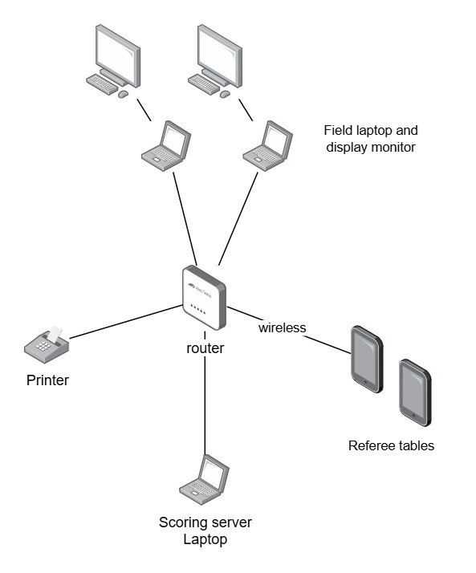
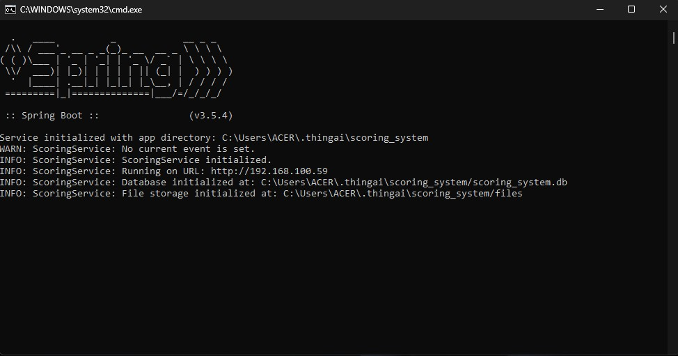
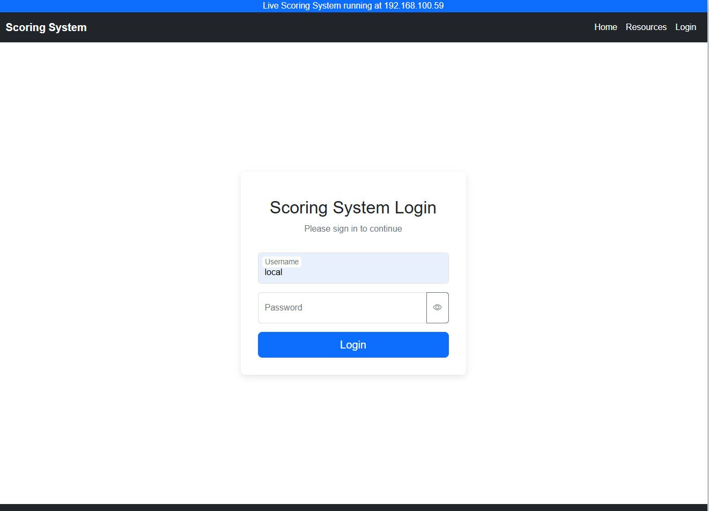
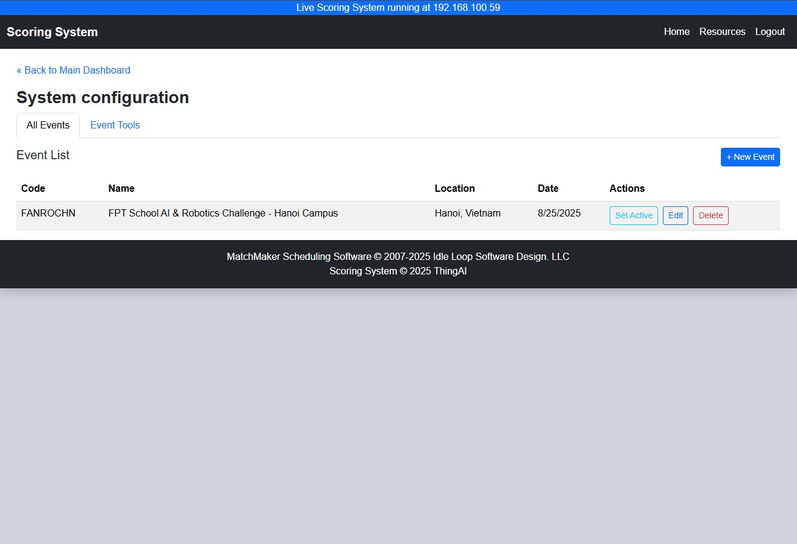
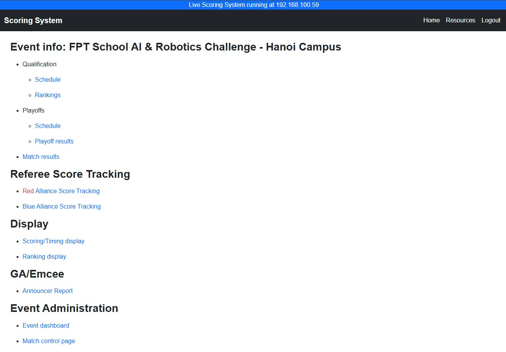

# Live Scoring System Software for Robotics Competitions

This repository contains the source code for a live scoring system designed for robotics competitions. The system allows real-time tracking and display of scores, team performance, and match statistics.

## Setup Guide

### Live Scoring System introduction
The Live Scoring System is a web-based application that provides real-time updates on scores and statistics during robotics competitions. It is designed to be user-friendly and accessible from various devices, including desktops, tablets, and smartphones.

**Who uses the Live Scoring System?**
- **Event Organizers:** To manage and display scores during competitions, ensuring smooth operation and engagement.
- **Scorekeepers:** To input scores and update match information in real-time.
- **Teams and Spectators:** To view live scores and match statistics as shown on large screens at the event.

### Hardware Requirements
To run the Live Scoring System effectively, the following hardware is recommended:
**Displays**:
- Large monitors or projectors for displaying scores to the audience, preferably with HDMI and 27-inch or larger screens for better visibility.
- For this software version, at least one display for each field of the event is recommended for on-field live scoring and timer.

**Tables**:
- Android and iOS tablets are both compatible with the FTC-Live software. Recommended tablet specifications include:
  - Screen Size: 9 inches or larger
  - Operating System: Android 8.0+ or iOS 12.0+
  - Connectivity: Wi-Fi capability for network access
  - App: Using Chrome browser for best compatibility
  
**Network**:
- Use a dedicated local network to connect your scoring devices, ensure a secure and stable connection.
- To ensure security for the system, preventing outside access, it is recommended to use a local network and create policies to restrict access to only authorized devices.
- Use a wired connection (Ethernet) whenever possible. Note: The real-time Scoring Referee
  tablets are wireless devices.

### System Requirements and Operation Architecture
The Live Scoring System is designed to operate on Windows and macOS platforms. Below are the system requirements and operation architecture:

**System Requirements**:
- Operating System: Windows 10 or macOS 10.15 (Catalina) or later
- Web Browser: Google Chrome (latest version recommended)
- 4 GB RAM minimum (8 GB recommended)
- 500 MB of free disk space
- Ethernet adapter (recommended for wired connections)

**Tablets Requirements**:
- Operating System: Android 8.0+ or iOS 12.0+
- Web Browser: Google Chrome (latest version recommended)
- Wi-Fi capability for network access

The Live Scoring System in real-life could be operated flexibly in different architectures based on the event's scale and requirements. These above-mentioned hardware and system requirements ensure optimal performance and reliability during competitions.

**Operation Architecture**:

Most commonly used cofiguration is as follows:


1. **Scoring server laptop**: This laptop hosts the Live Scoring System application and manages all scoring data. It should be connected to the local network via Ethernet for stability.
2. **Field display monitors**: These monitors are connected to the scoring server laptop and display real-time scores and match information to the audience.
3. **Referee tablets**: These tablets are used by referees to input scores and update match information. They connect to the scoring server laptop via the local network, preferably using Wi-Fi.
4. **Network switch/router**: A dedicated network switch or router is used to create a local network for the scoring system, ensuring secure and reliable communication between devices.

### Download the Live Scoring System Software
You can download the latest version of the Live Scoring System software from the releases section of this repository:
[Releases - Live Scoring System](https://github.com/lgthevinh/scoring-system/releases)

Be sure to download the version of the event you are organizing (e.g., FANROC, FARC, etc...). And read the release notes and download the latest stable version.

**Important tips for running the system software**:
- Ensure that Google Chrome is installed and is the default browser.
- **Important**: Firefox browser is not supported!
- Disable any firewall/virus protection on the computer running the server.
- Disable any ad blocking software on devices that will interface with the server. The ad blocking
software occasionally misinterprets server resources as ads.
- Clear the browser cache.

To run the Live Scoring System, follow these steps:
1. Extract the downloaded ZIP file to a desired location on your computer.
2. Navigate to the run file location, follow these folder path:
```aiignore
{extracted_folder}
    /vrc-scoring-system/
        run.bat (for Windows)
        run.sh (for macOS)
```
3. Execute the appropriate run file for your operating system:
   - For Windows: Double-click on `run.bat`
   - For macOS: Open a terminal, navigate to the folder, and run `sh run.sh`
4. The Live Scoring System server will start, and you should see a message indicating that the server is running.


Accessing the Live Scoring System by entering the host machine's IP address in the browser's address bar. For example:
```http://{your_host_machine_ip}``` or the url provided in the terminal output.

### Log in to the Live Scoring System

After accessing the Live Scoring System URL, you will be prompted to log in. Use the following default credentials if logging in from the host machine:
- **Username**: local

No password is required for local access.



### User guide

After logging in, you will be directed to the main page, here you will follow the steps below to set up and run the scoring system for your event.

#### Event preparation

Navigate to the `Event dashboard` section to set up your event details, including teams, matches, and scoring rules.



In the Event Dashboard, you can:
- Create and manage event information, and set active event for the system.
- Navigate to the `Event Tools` tab to create account for scorekeepers and referees, add/import teams and generate match schedule.

Set active the event for the system by clicking on the `Set Active` button.

#### During the event

After setting up the event, navigate to the Main screen, here you can view the information of the schedule, ranking, result with other options



#### After the event

After the event, you can export match results and rankings for record-keeping and analysis. To the folder that run file is located, you will find the database file of the event under `{EVENTCODE}.db` name, for the detailed score of each match, navigate to the `files` folder, you will find the JSON files of each match.

### Troubleshooting

If you encounter any issues while using the Live Scoring System, refer to the troubleshooting section in the documentation or open an issue in the repository for assistance.

Or contact the developer at
- Email: `everwellmax@gmail.com` (Official live scoring system maintainer)

Event specific software support contact:
- Email: `truongcongminhquan09@gmail.com` (FANROC event live scoring system maintainer)